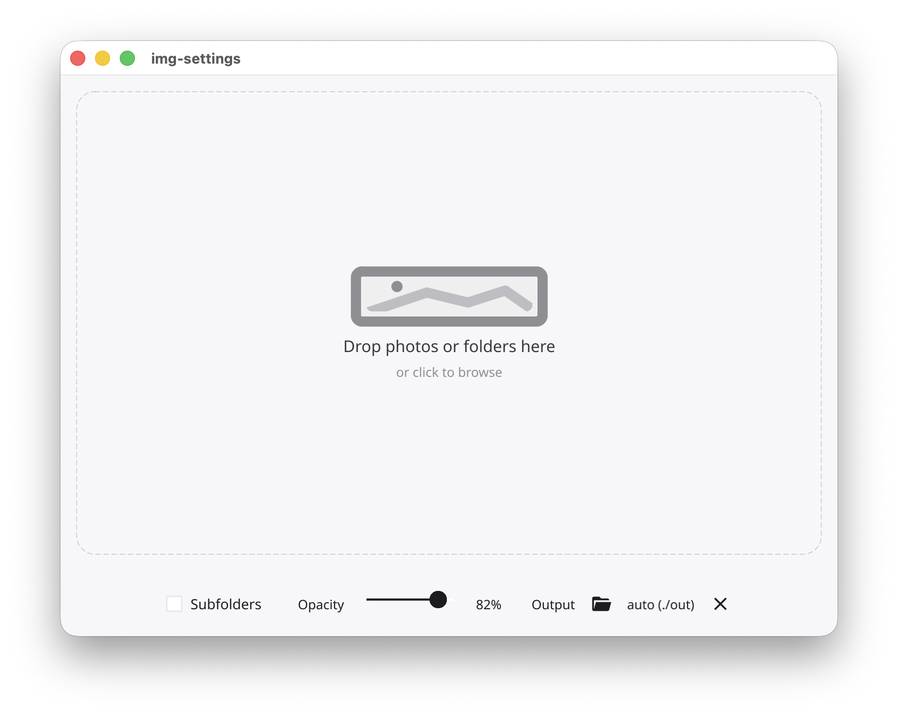
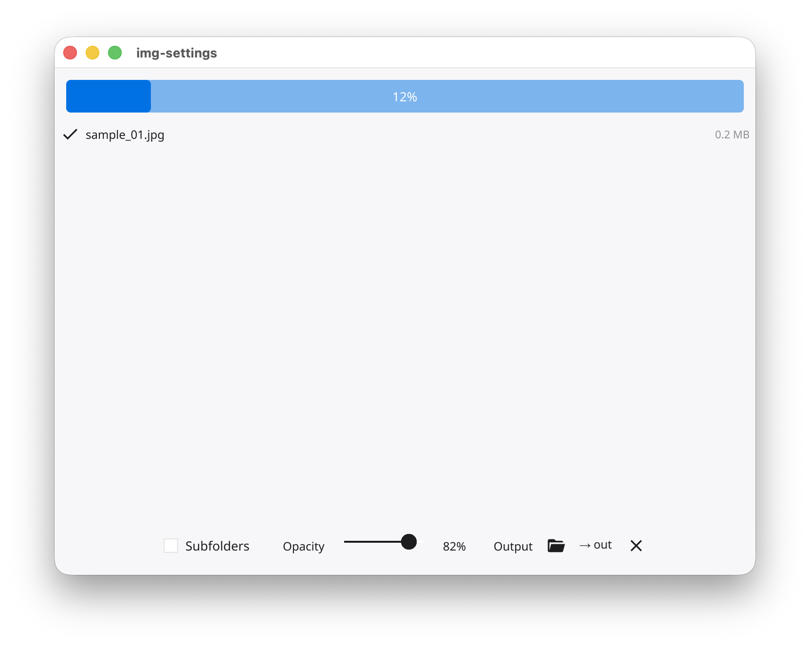
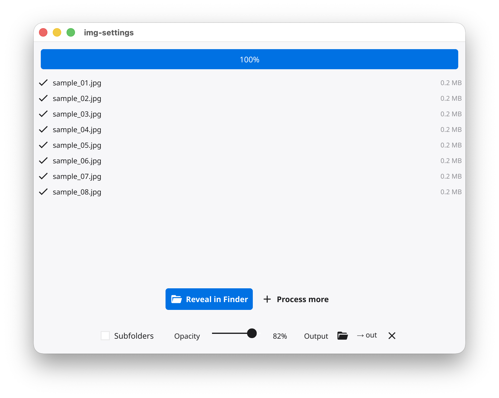

# img-settings — User Guide

**[🇪🇸 Leer en español](USER_GUIDE.es.md)**

---

## Table of contents

1. [What is img-settings?](#1-what-is-img-settings)
2. [Installation](#2-installation)
3. [Using the app (GUI)](#3-using-the-app-gui)
4. [Using the command line (CLI)](#4-using-the-command-line-cli)
5. [Understanding the watermark](#5-understanding-the-watermark)
6. [Working with Sony RAW files (ARW)](#6-working-with-sony-raw-files-arw)
7. [Troubleshooting](#7-troubleshooting)

---

## 1. What is img-settings?

img-settings is a small tool that takes your photos and adds a subtle watermark showing the camera settings used to take the shot — aperture, shutter speed, ISO, focal length, and camera model. The result is exported as a JPG file optimised for WhatsApp HD sharing (max 2560 px on the longest side, quality 92).

It works with JPG, PNG, and Sony ARW (RAW) files.

---

## 2. Installation

### Download

Go to the [Releases page](https://github.com/esteban-plaza/img-settings/releases/latest) and download the file for your system:

| System | File to download |
|---|---|
| Mac with Apple Silicon (M1/M2/M3/M4) | `img-settings-darwin-arm64` |
| Mac with Intel processor | `img-settings-darwin-amd64` |
| Windows | `img-settings-windows-amd64.exe` |

Not sure which Mac you have? Click the  menu → **About This Mac**. If it says "Apple M..." you have Apple Silicon. If it says "Intel" you have an Intel Mac.

### First launch on macOS

macOS will block the app the first time because it was downloaded from the internet and is not signed with an Apple developer certificate. To allow it:

**Option A — Terminal (quickest):**
```bash
xattr -d com.apple.quarantine ~/Downloads/img-settings-darwin-arm64
chmod +x ~/Downloads/img-settings-darwin-arm64
```

Then double-click the file to open it.

**Option B — System Settings:**
1. Try to open the app — macOS will block it and show an alert
2. Open **System Settings → Privacy & Security**
3. Scroll down to the security section and click **Open Anyway**

### Windows

Double-click `img-settings-windows-amd64.exe`. If Windows Defender SmartScreen shows a warning, click **More info → Run anyway**.

---

## 3. Using the app (GUI)

### Drop your photos



When you open the app you will see a large drop zone in the centre of the window. You can:

- **Drag and drop** one or more photos directly onto the window
- **Drag and drop a folder** to process all photos inside it
- **Click the drop zone** to open a folder browser

The app will start processing immediately after you drop the files.

### Settings toolbar

At the bottom of the window there is a toolbar with three options:

#### Subfolders
When you drop a folder, this option controls whether the app also looks inside subfolders.

- **Off (default):** only processes photos directly inside the dropped folder
- **On:** recursively finds all photos in every subfolder

#### Opacity
Controls how visible the watermark is, from 0% (invisible) to 100% (fully opaque). The default is **82%**, which gives a clean look without being too intrusive.

Move the slider left to make the watermark more transparent, or right to make it more prominent.

#### Output folder
The folder where the processed photos will be saved.

- **Default:** an `out/` folder is created automatically inside the folder you dropped
- **Custom:** click the folder icon to choose a different destination
- **Reset:** click the × button to go back to the automatic default

> The original photos are never modified. img-settings always writes to the output folder.

### Progress and results



Once processing starts, the drop zone is replaced by a progress bar and a list of files being processed. Each file shows:

- ✓ and the file size when it finishes successfully
- ✗ and an error message if something went wrong



When all files are done, two buttons appear:

- **Reveal in Finder / Open in Explorer** — opens the output folder so you can see your photos
- **Process more** — goes back to the drop zone to process another batch

---

## 4. Using the command line (CLI)

The CLI version is for users who prefer the terminal or want to automate batch processing.

### Basic usage

```bash
# Process all photos in a folder
img-settings-cli-macos /path/to/photos/

# Process a single file
img-settings-cli-macos photo.jpg

# Process multiple folders at once
img-settings-cli-macos ~/Desktop/session1/ ~/Desktop/session2/
```

### Options

| Option | Default | Description |
|---|---|---|
| `-out <folder>` | `out/` | Where to save the processed photos |
| `-opacity <0.0–1.0>` | `0.82` | Watermark opacity (0 = invisible, 1 = fully opaque) |

### Examples

```bash
# Save to a specific folder
img-settings-cli-macos -out ~/Desktop/watermarked/ ~/Photos/session/

# More transparent watermark
img-settings-cli-macos -opacity 0.5 photo.jpg

# Combine options
img-settings-cli-macos -out ~/Desktop/out -opacity 0.9 ~/Photos/
```

### Output

The CLI prints a line for each file as it finishes:

```
processing 12 file(s) → out/  [8 workers]

  DSC00123.ARW                              OK  (2.1 MB)
  DSC00124.ARW                              OK  (1.9 MB)
  DSC00125.jpg                              OK  (0.8 MB)
  ...

done: 12 ok, 0 failed
```

---

## 5. Understanding the watermark

The watermark is a dark pill-shaped label placed at the **bottom centre** of the image. It shows the following information when available in the photo's EXIF data:

| Icon | Field | Example |
|---|---|---|
| Camera | Camera model | ILCE-7RM5 |
| Aperture blades | Aperture | f/2.8 |
| Clock | Shutter speed | 1/250 |
| Chip | ISO | ISO 400 |
| Lens circles | Focal length | 85mm |

**Fields with no data are simply omitted.** If a photo has no EXIF data at all (for example, a screenshot), the photo is exported as-is without any watermark.

The watermark size adapts automatically to the image — it scales with the image height and shrinks the font if needed to fit all values within the image width.

---

## 6. Working with Sony RAW files (ARW)

img-settings supports Sony ARW files. It tries three methods in order:

1. **Embedded JPEG preview** — most Sony cameras embed a full-resolution JPEG inside the ARW file. img-settings extracts this directly, which is fast and requires no extra tools.

2. **dcraw** — if no usable preview is found, img-settings tries to use dcraw to decode the RAW data.

3. **ImageMagick** — if dcraw is not installed, it falls back to ImageMagick.

If none of these work, the file will be skipped with an error message. To install the fallback tools on macOS:

```bash
brew install dcraw
# or
brew install imagemagick
```

---

## 7. Troubleshooting

**The app does not open on macOS**
Follow the steps in [First launch on macOS](#first-launch-on-macos). macOS blocks apps that are not signed with an Apple developer certificate.

**The watermark is not showing**
The photo likely has no EXIF data. This can happen with screenshots, photos exported from some apps, or images that had their metadata stripped. Try a photo taken directly with a camera or phone.

**ARW files are skipped with an error**
Install dcraw or ImageMagick (see [Working with Sony RAW files](#6-working-with-sony-raw-files-arw)).

**The output photo looks the same size as the original**
If your photo is already 2560 px or smaller on its longest side, img-settings does not resize it. The resize only kicks in for larger images.

**I dropped a folder but some photos were not processed**
Check that the photos are in a supported format (JPG, PNG, ARW). If they are in subfolders, make sure the **Subfolders** toggle is turned on.
